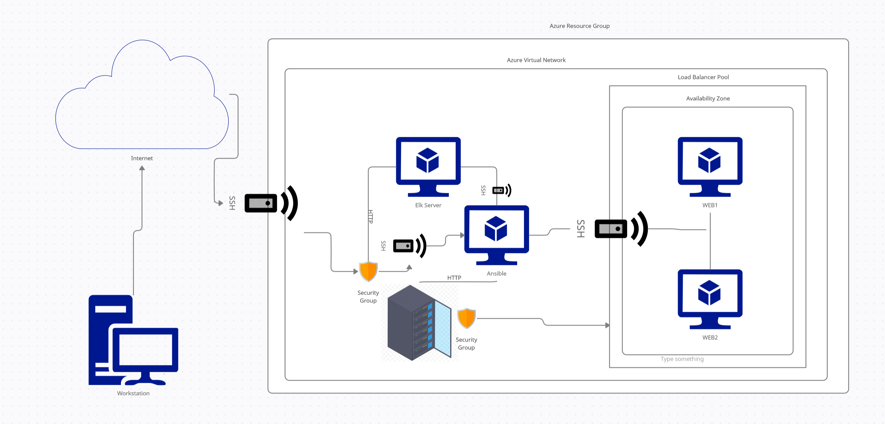

# upenn-eng-cyber-prj1
Week 13 - Project 1

## Project  Overview

The goal is to have an infrastructure that features both **load balancing** of inbound traffic as well as **monitoring** of a web application.

### Load Balancer
A load balancer provides critical protection to the availability of the given web application. Whether due to very high traffic or a purposed attack, processing load is distributed across multiple machines to ensure uptime even if one of the nodes is unresponsive.

Additional Benefits:
- Static entry point(s) to access a given application, providing another layer that can be monitored for security purposes
- Upon setup, load balancers are automatic and determine which nodes to forward users without manual intervention

### Logging and Monitoring
To best log and monitor traffic, a server with the following features is deployed:
- Elasticsearch
- Logstash
- Kibana
Thus, it can be referred to as the **ELK Server**.

To supplement these features, the following are also deployed:
- Filebeat - used to forward log data to either Elasticsearch (for ease of retrieval) or Logstash (for indexing and archiving)
- Metricbeat - used to collect key indicators from a given server, whether it is data on the operating system or running services. This too can output this data to Elasticsearch or Logstash with the same use case and benefits

### Network Topology

The topology is reflected in the following network diagram: 

### Deployment

For the deployment (as well as certain configurations), the process was automated using Ansible. Utilizing Ansible's YAML playbook, specific tasks are defined. The following were deployed/configured (along with dependencies) using the corresponding YAML playbooks:

- 
- 
- 
- 

### Network Security
The Ansible machine is the only node found in the network topology that has access to the internet. The rest are restricted to only intranet access. 

## Jumpbox Provisioner Accessibility
Accessiblity to the Ansible/Jumpbox Provisioner machine itself is restricted with the following rules
- IP: 73.12.X.X
- Port: 32

## Intranet Accessibility
All nodes within the network can only be accessed via the SSH Protocol (Port 22):

| Name     | IP Whitelist        |
|----------|---------------------|
| WEB1     | 10.1.0.5            |
| WEB2     | 10.1.0.6            |
| ELK      | 10.1.0.4            |
